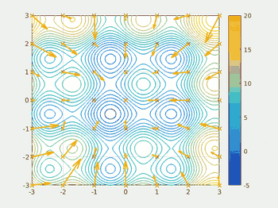
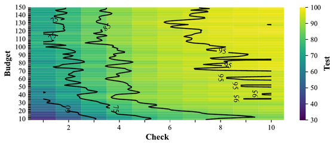
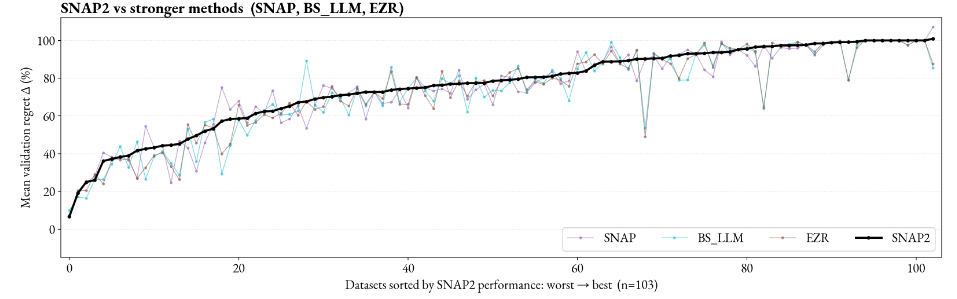
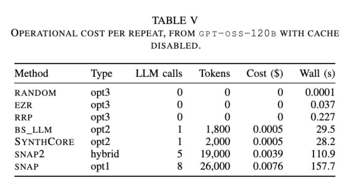

> **Summary:** Are you a good software engineer? What does "good"
mean? How about this: if anyone can do it for a dollar, a good
engineer does it for a penny. How? By knowing the parts: what each
does, how they fit, and how to reassemble them into something better
and faster. AI has parts too, symbolic and neural, and we will soon
have to reassemble them: Big AI is a leaking bubble, and when it pops
a third AI winter follows. This lecture is for the rats who will
thrive in that winter: engineers nimble enough to nibble AI down to
small models, small data, and small tools one person can build, test,
and understand. Learn the parts, and you are not renting the future
from the AI dinosaur. You are building it.

## Are you an LLM dinosaur, or a rat?

{width=300 .right}

Huge LLM companies dominate today's AI scene. They hold more resources
than we can ever know or access. They sell a world view that contains
only them. They change their technology so fast that no one can stay
current. They are like T-rex dinosaurs: they will monster you and your
career.

These AI dinosaurs look unstoppable, unquestionable, inevitable. It
seems all we can do is bow down, or run away. But a meteorite is
coming to wipe out their ecosystem:

(1) **Data centers die young** &ndash; the accountants book GPUs as
lasting five or six years, but the real economic life is closer to two
or three. Michael Burry warns that this slow write-off understates
depreciation by some $176 billion [^datacenters]. overstating
hyperscaler profits by 20% or more. And we keep running out of the
power and water [^datacenterswater] needed to drive them.

[^datacenters]: https://247wallst.com/investing/2026/07/02/the-michael-burry-bear-case-for-ai-chips-is-back-and-this-gpu-math-problem-wont-go-away/

[^datacenterswater]: https://eta.lbl.gov/publications/2024-lbnl-data-center-energy-usage-report

(2) **The benefits fall short of the promises** &ndash; e.g. look at
the AI slop [^aislop] generated by automatic coding tools; measured
carefully, AI assistants can even make experienced developers slower
[^ailabel]. Most corporate LLM pilot projects never show a measurable
profit.

[^aislop]: https://arxiv.org/pdf/2603.27249

[^ailabel]: https://arxiv.org/abs/2507.09089

(3) **The revenues fall short too** &ndash; in 2024, Sequoia Capital
asked AI's $600B question [^sequoia]: where is the revenue to cover
all that spending? No one answered. Instead, the gap has since
doubled, to some $1.2 trillion.

[^sequoia]: https://www.sequoiacap.com/article/ais-600b-question/

(4) **The earnings are circular** &ndash; large AI companies inflate
(fraudulently?) their reported earnings with "I pay you to buy from
me" deals [^circular].

[^circular]: https://www.linkedin.com/posts/liamdarmody_this-bloomberg-diagram-looks-like-a-bubble-share-7382537328805957632-28YB/

(5) **Local models keep getting better** &ndash; when the model
running on your laptop [^ollama] is good enough, the economic case for
the expensive cloud disappears.

[^ollama]: https://ollama.com

(6) **Open models keep getting better too** &ndash; as open source
Chinese models such as DeepSeek [^deepseek] and Qwen [^qwen] come on
line, companies like OpenAI and Anthropic have less and less that only
they can sell.

[^deepseek]: https://github.com/deepseek-ai

[^qwen]: https://github.com/QwenLM

(7) **The regulators are waking up** &ndash; governments respond
slowly, but they do respond; see the EU AI Act [^euai].

[^euai]: https://digital-strategy.ec.europa.eu/en/policies/regulatory-framework-ai

So we are heading for a third AI winter [^winter]: a steep decline in
public interest, venture capital, and corporate funding for all things
AI. How will you survive it? Will you move to smart hardware/software
combinations? Will you jump to outer space?

Here is another option. Look down. Scurrying around the feet of the
LLMs are little rodents, eating the dinosaurs' eggs. The rats are
small, cheap, fast, and curious. They need no data center. They run on
found food: small models, small data, small tools that one person can
build, test, and understand. When the meteorite lands, the dinosaurs
starve while the rats inherit the earth[^nope].

This subject teaches you how to be a rat. We break up AI into numerous
small parts and discuss shortcuts that make each part very fast.
Kautz's neurosymbolic taxonomy (discussed below) makes the same move
at field scale: mix and match the best of the old AI with the best of
the new.

So be a discerning user of AI technology. Assess the merits of each
approach, and know when to use what. Some of the discussion is
theoretical&mdash;challenge problems where you can prove me wrong. But
as we shall see, other parts are strongly supported by extensive
experimental results.

[^winter]: https://en.wikipedia.org/wiki/AI_winter

[^nope]: Full disclosure: my "rats ate the dinosaurs" story, while
fun, is inaccurate. True rats appeared some 50 million years *after*
the dinosaurs fell; the egg thieves scurrying under actual dinosaur
feet were other small early mammals. And no egg thief killed the
dinosaurs. An asteroid did, and that die-off struck at the same time
on land and in the deep oceans, where rats cannot swim, breathe, or
live (let alone eat). Also, one dinosaur lineage shrugged off the
meteorite and still surrounds us: the birds. But the moral survives
the fact-check. Most K-Pg survivors were small, cheap-to-run
generalists; the giant specialists starved.

## How to be a rat {#rat_tricks}

Here are four rat tricks that are very useful.

(1) **Reuse, then refactor**: Rats poke around the ground, feeding on
whatever tidbits they can find. Good software engineers do the same:
we look inside the skills we ask our AI to deploy, and before writing
new code for a new skill, we reuse old code. This subject demonstrates
that with some domain engineering[^seai]. Suppose we were trying to
buy a car. Here are ten skills we might ask of our AI:

| task                                            | skill                     | %LOC | new LOC |
|-------------------------------------------------|---------------------------|-----:|--------:|
| From 400 cars, find unusually great buys.       | remember (representation) |  45% |     150 |
| Guess the fuel use before we see the sticker    | guess (prediction)        |  17% |      57 |
| Say when "better" is real, and when it is noise | certify (certification)   |  12% |      40 |
| Decide on the spot as cars arrive one at a time | flow (streaming)          |   8% |      27 |
| Say why the bad cars are slow, or thirsty       | blame (diagnosis)         |   6% |      20 |
| Justify any verdict to a skeptical buyer        | justify (explanation)     |   4% |      13 |
| Find the best car, test-driving very few        | choose (optimization)     |   3% |      10 |
| Find the cheapest change that fixes this car    | fix (repair)              |   3% |      10 |
| Spot a strange car: a typo, or a scam           | spot (anomaly detection)  |   2% |       6 |
| Race our skills against the field's best        | race (baselining)         |   0% |       0 |
| **Totals**                                      |                           | **100%** | **333** |

As seen here, the first skill costs 45% of the code: it pays for the
data structures everything shares. After that, each new skill mostly
rewires old parts: prediction costs 17%, optimization 3%, anomaly
detection 2%. Skill *i+1* reuses the machinery already built for
skills *1..i*.

Reuse alone is not enough: rat engineers also refactor. If any fool
can do it for a dollar, an engineer asks how to do it for a penny.
What code can we throw away, with everything still working? The table
above shows the payoff of all that redoing: a few hundred lines of
code now support world-class optimization and explanation algorithms.
Ganguly's FSE work[^ganguly] shows these data-light methods matching
far heavier learners. Rayegan's JSS work[^rayegan] shows the same
small toolkit generating explanations that are both shorter and
clearer than those of its rivals. Reuse, then refactor, and everything
gets simple, understandable, verifiable.

[^seai]: [Menzies: Ten lectures on data-lite AI, at the REPL](https://github.com/txt/seai26f). Tim Menzies. NCSU course notes, 2026.

[^ganguly]: [Ganguly & Menzies: How low can you go? The data-light SE challenge](https://arxiv.org/abs/2512.13524). Kishan Kumar Ganguly, Tim Menzies. FSE 2026. arXiv:2512.13524.

[^rayegan]: [Rayegan & Menzies: Minimal data, maximum clarity: A heuristic for explaining optimization](https://arxiv.org/abs/2509.08667). Amirali Rayegan, Tim Menzies. J. Systems and Software, 2026. arXiv:2509.08667.

(2) **Keep it simple, keep it stochastic**: Exploring every choice, in
every order, is how careful solvers work, and it is why they crawl.
Staggering about, choosing at random, can be orders of magnitude
faster: a random step costs almost nothing, so you can afford millions
of them. The rat trick for large problems has two parts: stagger, then
summarize what the staggers revealed.

MaxWalkSat[^selman] is the classic. To solve a hard logic problem,
start with a random assignment. Find a broken clause and flip one of
its variables: usually the flip that fixes most, sometimes any
variable at all, chosen at random. That is the whole algorithm.
Selman, Kautz, and Cohen showed this pinch of noise let a simple local
search crack constraint problems that defeated the systematic solvers
of the day. Here the summary is tiny: the best assignment so far, and
a count of broken clauses.

{width=350 .right}

Particle swarm optimization[^pso] (see the figure at right) makes the
summary explicit. Each particle in the flock starts at a random guess
and staggers, but two memories pull it back: the best place *it* has
seen, and the best place *anyone* has seen. Random motion explores;
the two bests summarize what exploring found; and from those three
simple pulls the swarm circles in on the prize.

The same shape appears in machine learning. Bergstra and
Bengio[^bergstra] showed that random trials tune learners better than
careful grid search: the grid spends its budget on parameters that do
not matter, while scattered random points quickly reveal which few do.
And it is why EZR does so much with so little code: stagger through a
few dozen random labels, then summarize them into a small tree (trick
3, below, counts how few labels that takes).

[^selman]: [Selman et al.: Noise strategies for improving local search](https://cdn.aaai.org/AAAI/1994/AAAI94-051.pdf). Bart Selman, Henry Kautz, Bram Cohen. AAAI 1994, 337–343.

[^pso]: [Kennedy & Eberhart: Particle swarm optimization](https://doi.org/10.1109/ICNN.1995.488968). James Kennedy, Russell Eberhart. ICNN 1995, 1942–1948. doi:10.1109/ICNN.1995.488968.

[^bergstra]: [Bergstra & Bengio: Random search for hyper-parameter optimization](https://jmlr.org/papers/v13/bergstra12a.html). James Bergstra, Yoshua Bengio. J. Machine Learning Research 13 (2012), 281–305.

(3) **Pick your battles: good enough is near enough optimization
(NEO)**: A little maths explains the success of random search. Random
search assumes that near enough is good enough. That assumption makes
search cheap.

First, see what search can cost. Some tasks are inherently complex.
*Reward-free reinforcement learning* for autonomous cars must learn
enough to satisfy any future, as-yet-unwritten safety law. Jin et
al.[^jin] show that even simple versions of this task need
1015 samples.

Costs fall if you know how solutions will be judged. Search then
becomes the *Best Arm* problem. Hoeffding[^hoeffding] says: to
distinguish *A* alternatives with accuracy ε and confidence *C*,

- samples(best-arm)  >=  (2/ε²) · log( 2A / (1−C) )

So a dozen binary choices (A=212), at C=95% and ε=5%, needs
9,605 samples. Much better than 1015, but still impractical
in many domains.

(Aside: do not expect LLMs to label those samples for you. For SE
problems, Ahmed et al.[^ahmed] warn that LLMs assist labeling but
cannot automate it. Other methods are no better. Herbold et
al.[^herbold] report that labeling tools debugged for decades still
make many errors; Yu et al.[^yu] find massive labeling errors in
real-world SE data sets. Human experts are slow, and grow error-prone
when rushed; Easterby-Smith[^easterby] reports hours of work for just
a few cases.)

Costs fall again if near enough is good enough. Real solutions can
vary by a small amount, so a rat may stop at any solution
indistinguishable from the best. Cohen calls two solutions "small to
medium" different when they are 0.2&sigma; to 0.5&sigma; apart, and a
normal curve spans &plusmn;3&sigma;. So "indistinguishable" means *p =
((0.2+0.5)/2)/6 &approx; 6%*. Hamlet gives the confidence *C* of
finding an event of probability *p* in *n* independent trials:

- C = 1 - (1-p)n,
- so  samples(NEO) = log(1 - C) / log(1 - p).

At C=0.95 and p=0.06, rats can stop after only n=48 samples.

Costs fall once more with prior knowledge. Suppose those 48 samples
built a model that can guess which of two solutions is worse. A binary
chop then finds good solutions in:

- samples(clever) = log2(samples(NEO)) = log2(48) &approx; 6 samples.

This maths rests on wildly optimistic assumptions: solutions are
evenly distributed, along one dimension, and that dimension is
Gaussian. Yet in practice, the numbers hold.

{width=400 .right}

Figure 2 of [arXiv:2606.03640](https://arxiv.org/abs/2606.03640) built
models from 10 to 200 samples, then checked the top 1 to 10 sorted
items in a holdout set. This ran 100,000 times, picking data sets and
hyperparameters at random each time, over 127 data sets from the MOOT
repository[^moot]. The vertical axis is the build budget *y*; the
horizontal axis is the top *x* items checked. Above a budget of about
50 and a check of about 5, everything is flat at 95. The paper's own
summary: at `(budget, check) = (50, 6)` the learner "usually achieves
above an 85% win", and "checking beyond 7 items seems not particularly
useful".

In a result that should please every rat, those numbers (50, 6) sit
very close to the (48, 6) computed above.

[^jin]: [Jin et al.: Reward-free exploration for reinforcement learning](https://proceedings.mlr.press/v119/jin20d.html). Chi Jin, Akshay Krishnamurthy, Max Simchowitz, Tiancheng Yu. ICML 2020.

[^hoeffding]: [Hoeffding: Probability inequalities for sums of bounded random variables](https://www.tandfonline.com/doi/abs/10.1080/01621459.1963.10500830). Wassily Hoeffding. J. Amer. Statist. Assoc. 58, 301 (1963), 13–30. doi:10.1080/01621459.1963.10500830.

[^ahmed]: [Ahmed et al.: Can LLMs Replace Manual Annotation of Software Engineering Artifacts?](https://arxiv.org/abs/2408.05534). Toufique Ahmed, Premkumar Devanbu, Christoph Treude, Michael Pradel. MSR 2025. arXiv:2408.05534.

[^herbold]: [Herbold et al.: Problems with SZZ and features: An empirical study of the state of practice of defect prediction data collection](https://doi.org/10.1007/s10664-021-10092-4). Steffen Herbold, Alexander Trautsch, Fabian Trautsch, Benjamin Ledel. Empirical Softw. Engg. 27, 2 (Mar 2022). doi:10.1007/s10664-021-10092-4.

[^yu]: [Yu et al.: Identifying self-admitted technical debts with Jitterbug: A two-step approach](https://doi.org/10.1109/TSE.2020.3031401). Zhe Yu, Fahmid M. Fahid, Huy Tu, Tim Menzies. IEEE Trans. Software Engineering 48, 5 (2022), 1676–1691. doi:10.1109/TSE.2020.3031401.

[^easterby]: [Easterby-Smith: The design, analysis and interpretation of repertory grids](https://doi.org/10.1016/S0020-7373(80)80032-0). Mark Easterby-Smith. Int. J. Man-Machine Studies 13, 1 (1980), 3–24. doi:10.1016/S0020-7373(80)80032-0.

[^moot]: [Menzies et al.: MOOT: a repository of many multi-objective optimization tasks](https://github.com/timm/moot). Tim Menzies, Tao Chen, Yiqi Ye, Kishan K. Ganguly, Amirali Rayegan, Suvodeep Srinivasan, Andre Lustosa. MSR 2026, 584–589.

(4) **Look for the cracks between the parts**: AI is not one thing. It
is parts, joined at seams. My challenge to you is this: we drop our
little nimble rats into those seams, can we build a better faster AI?

The following table extends Henry Kautz's 2020 AAAI address[^kautz],
and his 2024 update of it, which together map eight ways to join old
symbolic AI (logic, search, solvers) to new neural AI (deep learners,
LLMs). We add two more: symbolic alone, and neural alone, for ten
cells in all. Most folks who just use ChatGPT, and nothing else, do
not realize they are stuck in one tiny corner of this space of
possibilities. The other nine cells are where the rats can zip in and
speed things up.

Kautz's notation is a little arcane, so here is a simpler one. Write
*S* for a symbolic part, *N* for a neural part. Then read the joins
off the table, each with an SE example:

| pattern   | meaning                                | SE example                                                                                          |
|-----------|----------------------------------------|-----------------------------------------------------------------------------------------------------|
| S         | symbols alone                          | EZR's domain engineering (trick 1, above): optimize and explain in 333 lines                        |
| N         | a net alone                            | LLMs label SE optimization data; Senthilkumar's EMSE work[^senthilkumar1] makes those raw labels robust             |
| S; N; S   | symbols in, net thinks, symbols out    | prompt an LLM with code, read back a review; the ChatGPT cell                                       |
| S[N]      | symbolic boss calls a neural helper    | an issue-triage pipeline (the boss) calls a sentiment net to score each incoming report (Lin et al.[^lin]); AlphaGo's tree search calling its neural scorer is Kautz's classic case |
| N; S      | net proposes, symbols check            | LLMs translate requirements to temporal logic, then model checkers test them (nl2spec[^cosler]); LLM warm-starts seed a classical active learner (Senthilkumar's TOSEM work[^senthilkumar2]) |
| S; N      | symbols build the net's diet           | SE knowledge builds the training pairs; rules compile away into weights (Lample & Charton[^lample]; Hu et al.[^hu]) |
| S as N    | rules are templates for the net        | logic clauses shape the network's structure (Logic Tensor Networks[^ltn])                                 |
| S in loss | rules graded into training             | coding standards as semantic loss: breaking a rule costs the net at training time (Xu et al.[^xu])       |
| N[S]      | neural boss calls a symbolic helper    | an LLM that calls calculators, search, and solvers mid-answer (Toolformer[^schick]); Kautz's own favorite, and his demo teaches GPT to call a SAT solver |
| S then N  | cheap symbols first, dear net second   | classical search finds good seeds; the LLM polishes them (Srinivasan[^srinivasan])                               |

The N[S] row hides a joke at the dinosaurs' expense. When Claude's own
source code recently bumped into public view, readers found much S
inside that N: prompts, rules, regular expressions, and tool calls,
all wrapped around the net. Even the flagship dinosaurs are secretly
neurosymbolic.

{width=600}

The last row is the newest trick, and the figures show why it works.
Srinivasan shows that order matters: run the cheap classical optimizer
first, then hand its best results to the LLM. Across 103 MOOT data
sets (above), that hybrid, SNAP2, matches or beats SNAP (the LLM-heavy
tool) and every other method tried. And note how well the little
symbolic EZR tracks the winners.

{width=420}

Then look at the bill (above). Per repeat, SNAP spends 8 LLM calls,
26,000 tokens, and 158 seconds. The SNAP2 hybrid spends 5 calls and
111 seconds. EZR alone spends zero calls, zero tokens, zero dollars,
and 0.04 seconds. So if near enough is good enough (trick 3), the
little symbolic engine does the job in a blink, with tiny code and no
tokens at all.

The lesson of the whole table is the same. Do not buy one giant AI. Be
a discerning shopper. Ask what each part does cheaply and well, then
join the parts at the seam that pays.

[^kautz]: [Kautz: The third AI summer: AAAI Robert S. Engelmore Memorial Lecture](https://doi.org/10.1002/aaai.12036). Henry Kautz. AI Magazine 43, 1 (2022), 105–125. doi:10.1002/aaai.12036.

[^senthilkumar1]: [Senthilkumar & Menzies: From brittle to robust: Improving LLM annotations for SE optimization](https://arxiv.org/abs/2603.22474). Lohith Senthilkumar, Tim Menzies. Empirical Software Engineering, 2026. arXiv:2603.22474.

[^lin]: [Lin et al.: Sentiment analysis for software engineering: How far can we go?](https://doi.org/10.1145/3180155.3180195). Bin Lin, Fiorella Zampetti, Gabriele Bavota, Massimiliano Di Penta, Michele Lanza, Rocco Oliveto. ICSE 2018, 94–104. doi:10.1145/3180155.3180195.

[^cosler]: [Cosler et al.: nl2spec: Interactively translating unstructured natural language to temporal logics with LLMs](https://arxiv.org/abs/2303.04864). Matthias Cosler, Christopher Hahn, Daniel Mendoza, Frederik Schmitt, Caroline Trippel. CAV 2023. arXiv:2303.04864.

[^senthilkumar2]: [Senthilkumar & Menzies: Can large language models improve SE active learning via warm-starts?](https://arxiv.org/abs/2501.00125). Lohith Senthilkumar, Tim Menzies. ACM Trans. Software Engineering and Methodology, 2026. arXiv:2501.00125.

[^hu]: [Hu et al.: Harnessing deep neural networks with logic rules](https://arxiv.org/abs/1603.06318). Zhiting Hu, Xuezhe Ma, Zhengzhong Liu, Eduard Hovy, Eric Xing. ACL 2016. arXiv:1603.06318.

[^lample]: [Lample & Charton: Deep learning for symbolic mathematics](https://arxiv.org/abs/1912.01412). Guillaume Lample, François Charton. ICLR 2020. arXiv:1912.01412.

[^xu]: [Xu et al.: A semantic loss function for deep learning with symbolic knowledge](https://arxiv.org/abs/1711.11157). Jingyi Xu, Zilu Zhang, Tal Friedman, Yitao Liang, Guy Van den Broeck. ICML 2018. arXiv:1711.11157.

[^schick]: [Schick et al.: Toolformer: Language models can teach themselves to use tools](https://arxiv.org/abs/2302.04761). Timo Schick, Jane Dwivedi-Yu, Roberto Dessì, Roberta Raileanu, Maria Lomeli, Luke Zettlemoyer, Nicola Cancedda, Thomas Scialom. NeurIPS 2023. arXiv:2302.04761.

[^ltn]: [Badreddine et al.: Logic tensor networks](https://arxiv.org/abs/2012.13635). Samy Badreddine, Artur d'Avila Garcez, Luciano Serafini, Michael Spranger. Artificial Intelligence 303 (2022). arXiv:2012.13635.

[^srinivasan]: [Srinivasan & Menzies: Better together, in the right order: Classical-then-LLM optimization for SE](https://arxiv.org/abs/2607.02583). Srinath Srinivasan, Tim Menzies. arXiv:2607.02583, 2026.

## Eating our own dog food

"Eating your own dog food" (or "dogfooding") in software engineering
means using your own tools and processes to run your own daily tasks.
It turns out this page is powered by dog food. In an example of S[N]
(symbolic boss, neural helper), it was generated as follows:

Markdown, then one `sed`, then `pandoc`, then 30 lines of CSS. The
tooling and much of the copy were shaped with an LLM, driven by
prompts like: *"write prep.awk, much simpler than md2html"* &middot;
*"would a general markdown tool reduce prep to just preprocessing?"*
&middot; *"css under 200 words, not minimized"* &middot; *"less
brutalist; centre it; Optima"* &middot; *"say it in half the space"*
&middot; *"kill 2 more lines"* &middot; *"why 2 PSO graphics?"*
&middot; *"write a better random section: exploring every choice is
slow; stagger, then summarize what the staggers revealed"* &middot;
*"one blank line before each set of refs"* &middot; *"'ub' in Fork me
on GitHub obscured"*. Short prompts, many rounds; the human chose, the
machine typed. Cheap symbolic tools (`sed`, `pandoc`, `make`) wrapped
around a neural helper.

Note the obsession with simplification. Do it, then do it again,
shorter.
