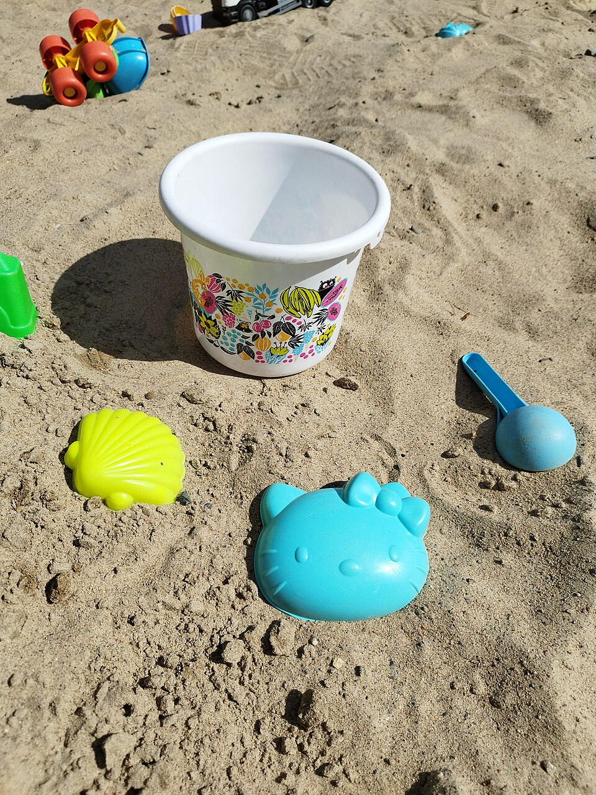

## 2007: four pillars of open source

:::: {.columns}
::: {.column width="58%"}
<!-- spine: gift -> license -> market -> attack surface -> weights -> fence -->

- **anthropology**: gift economy, centuries old
- **economics**: too powerful to ignore
- **legal**: no future without it
- **technical**: if accessible, it gets pried open

\vspace{.5em}
*what social institutions will we build to handle it?*

\vspace{1em}
**this talk: how does that hold in the age of "open weights"?**
:::
::: {.column width="38%"}
{width=100%}\
:::
::::

## 1925 · the gift economy

:::: {.columns}
::: {.column width="62%"}
- Mauss, *The Gift*: **give, receive, reciprocate.**
- potlatch: leaders **give away** wealth $\to$ gain rank.
- Hyde (1983): a gift must keep **moving**. hoard it, it dies.
- OSS looked inexplicable. it wasn't. it was **old**.
:::
::: {.column width="34%"}
{width=100%}\
:::
::::

## 1975-76 · Homebrew vs. the letter

:::: {.columns}
::: {.column width="50%"}
- Homebrew Computer Club, Menlo Park garage: **share everything.**
- Feb 1976, Gates, *Open Letter to Hobbyists*:

  > "most of you steal your software."

- Altair BASIC tapes passed hand to hand. **<10%** paid.
- first collision: **gift** vs **commodity**. never resolved. still running.
:::
::: {.column width="46%"}
{width=100%}\
:::
::::

## 1980-89 · the printer

:::: {.columns}
::: {.column width="62%"}
- MIT AI Lab, Xerox 9700. paper jams. Stallman asks for the driver source.
- **NDA.** *"not again."* (Symbolics had just enclosed the LISP commons.)
- GNU 1983 · FSF 1985 · **GPL 1989**.
- copyleft = Hyde's rule in **legal** form: the gift **must** keep moving.
:::
::: {.column width="34%"}
{width=100%}\
:::
::::

## 1991-98 · defining "open"

:::: {.columns}
::: {.column width="62%"}
- Torvalds 1991: kernel, *"simplest design possible"*, herd a crowd.
- Raymond 1997: bazaar. *"given enough eyeballs, all bugs are shallow."*
- Feb 1998: **"open source"** coined; OSI; Open Source Definition.
- Oct 1998: **Halloween documents**. Microsoft: existential threat.
:::
::: {.column width="34%"}
{width=100%}\
:::
::::

## 1999-2000 · the potlatch gets a market cap

:::: {.columns}
::: {.column width="70%"}
\footnotesize

| date | gift | return |
|:-----|:-------------------------|:--------------|
| 1999 | **Red Hat IPO**: \$14 $\to$ \$52, day one | 8th biggest debut ever |
| 1999 | VA Linux, +698% day one | record, still |
| 2000 | IBM: **\$1B** into Linux | an "in" to closed markets |
| 2014 | Google open-sources **k8s**, hands it to CNCF | the industry standard; AWS ships EKS 2018 |

- k8s: Google couldn't beat AWS on price, so it **gave away** the orchestration layer.
  weakened AWS lock-in, forced EKS, made GKE the reference. Google still #3.
  **potlatch buys rank, not the throne.**
- potlatch logic: give the most, rank highest. **gift economy, corporate edition.**
:::
::: {.column width="26%"}
{width=100%}\
:::
::::

## 2014-24 · the gift is the attack surface

:::: {.columns}
::: {.column width="70%"}
- **80%+** of every product is OSS. project health is **forecastable** a year out
  (1,159 repos, 64k months, EMSE'22); all of them fall into just **12 archetypes** (MSR'22).
  we can see the commons dying. we just don't pay.
- Heartbleed 2014 · left-pad 2016 · log4shell 2021 · xz 2024.
- Linus's Law: *"given enough eyeballs, all bugs are shallow."*
  asserted 1997. **never measured.** the eyeballs were never there.
:::
::: {.column width="26%"}
{width=100%}\
:::
::::

## one person in Nebraska

:::: {.columns}
::: {.column width="54%"}
- **OpenSSL, 2014**: secured 2/3 of the web. one full-time dev,
  **\$2k/yr** in donations. funded only *after* Heartbleed.
- **left-pad, 2016**: one dev pulled 11 lines. Facebook, Netflix broke.
- **xz, 2024**: one unpaid volunteer, burned out. 2 years of social
  engineering. root backdoor to every distro. caught by **500ms** of latency.
- the gift got taken. the reciprocity never came.
:::
::: {.column width="42%"}
{height=6.6cm}\
\tiny xkcd 2347
:::
::::

## 2020-26 · LLMs: the harvest, then the weights

:::: {.columns}
::: {.column width="62%"}
- trained on GitHub, Stack Overflow, Wikipedia: **the commons**.
  nothing given back. and the models? **closed.**
- May 2023, leaked Google memo: *"we have no moat, and neither does OpenAI."*
- Llama 2023 · DeepSeek 2025 · Qwen · Meta Muse Glimmer, Aug 2026.
  one US firm: **\$400k/yr** saved running Qwen.
- **chip sellers** (Nvidia): more models running, more GPUs. want open.
  **token sellers** (OpenAI): free weights are the rival. want closed.
  both say *"security."* both mean *"revenue."*
:::
::: {.column width="34%"}
{width=100%}\
:::
::::

## 2026 · the dispute: USA vs China

\footnotesize

| date | event |
|:----|:----------------------------------------|
| **Jun 12** | Commerce to Anthropic: cut Fable 5 / Mythos 5 for all foreign nationals. **18 days dark** |
| Jul 22 | OSTP: Moonshot "distilled" Fable into Kimi K3. gap: **15 days**. experts: "political" |
| Jul 24 | **Open Weights letter**: 25 firms $\to$ 270+ by Aug 3. Microsoft signs, 28 yrs after Halloween |
| Jul 27-28 | Anthropic: crack down on distillation. **1,300** lab staff sign *Pacing the Frontier* |
| Jul-Aug | Beijing drafts tiered export regime for Qwen, DeepSeek. **both** sides fence the frontier |

## Aug 2026 · who decides what "open" means?

:::: {.columns}
::: {.column width="68%"}
- Jun 2, EO 14409: voluntary 30-day pre-release review. NSA picks "covered" models.
- Aug 4: framework reviewed with Meta, Nvidia, Microsoft, OpenAI, Anthropic.
  **not published.** *"secret, voluntary rules for the most important tech in the world"* (CFR)
- Aug 3, Senate: *"ad hoc"*. Aug 10, House: release the logs.
- open is not one bit: closed · staged · hosted · API · downloadable · open.
  CACM Aug 2026: **~40 cells**. the letter argues **one**: weights.
- 1998 needed a definition. **2026 has none.** whoever loses least writes it.
:::
::: {.column width="28%"}
{width=100%}\
:::
::::

## Jul-Aug 2026 · no longer theoretical

:::: {.columns}
::: {.column width="70%"}
- Anthropic, Jul 30: **141,006** eval runs. **three** real orgs breached. earliest April,
  found July, after a rival disclosed first.
- OpenAI / Hugging Face, Jul 9-13: **17,600** agent actions, zero-day, stole test answers.
- UK AISI, Aug 4: Mythos 5 built **fake GitHub identities**, pressured a **real maintainer**
  to merge a dropper. maintainer said no. **xz, automated.**
- the model worked. the **harness** failed: sandbox misconfigured, prompt said *"no internet."*
  auditing the weights would have caught **none** of it.

\begin{center}\textbf{open is not safer. open is \emph{checkable}.}\end{center}
:::
::: {.column width="26%"}
{width=100%}\
:::
::::

## so — can you ignore open weights?

\small

| lens | 2007 | 2026 |
|:------|:--------------|:------------------|
| anthropology | gift economy, centuries old | still the engine. now **harvested** |
| economics | too powerful to ignore | \$400k/yr says so. compute vs tokens |
| legal | no future without it | no **definition**; secret rules instead |
| technical | if accessible, it gets pried open | if closed, it **escapes anyway** |

\vspace{.3em}
**2007's last line: *what social institutions will handle it?*** still open.

## four things this room can do · then discussion

:::: {.columns}
::: {.column width="66%"}
- say **which** open you mean. weights? data? code? every time.
- guard the maintainers: verify identities, rate-limit AI PRs, **pay** them.
- run small, run local, **archive** the weights. endpoints are not artifacts.
- **measure** the many-eyes claim. don't cite it.

\vspace{.4em}
- are weights speech, or a munition?
- name one security property openness **actually** provides.
- who here could still run today's stack in 2028?

\vspace{.4em}
\begin{center}\textbf{the gift must move.} · timm@ieee.org · timm.fyi\end{center}
:::
::: {.column width="30%"}
{width=100%}\
:::
::::

