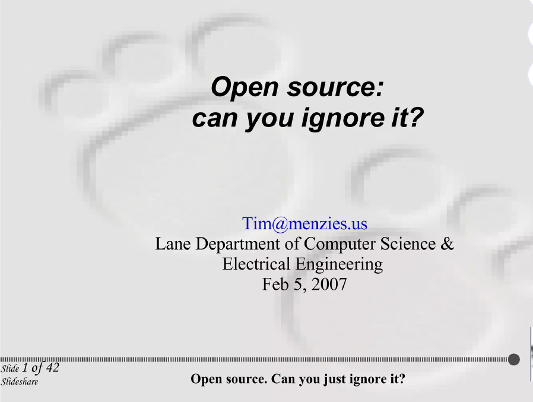
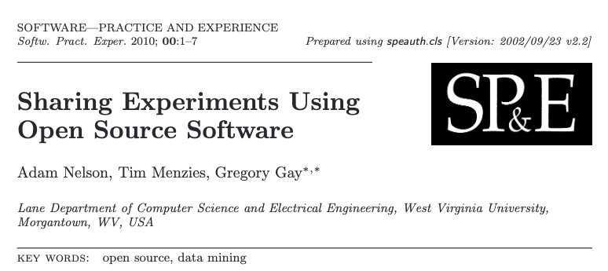
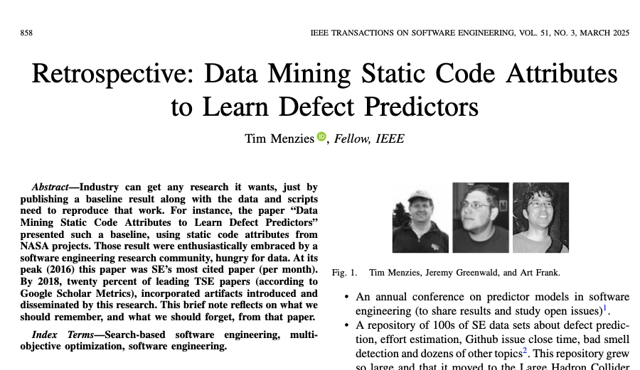
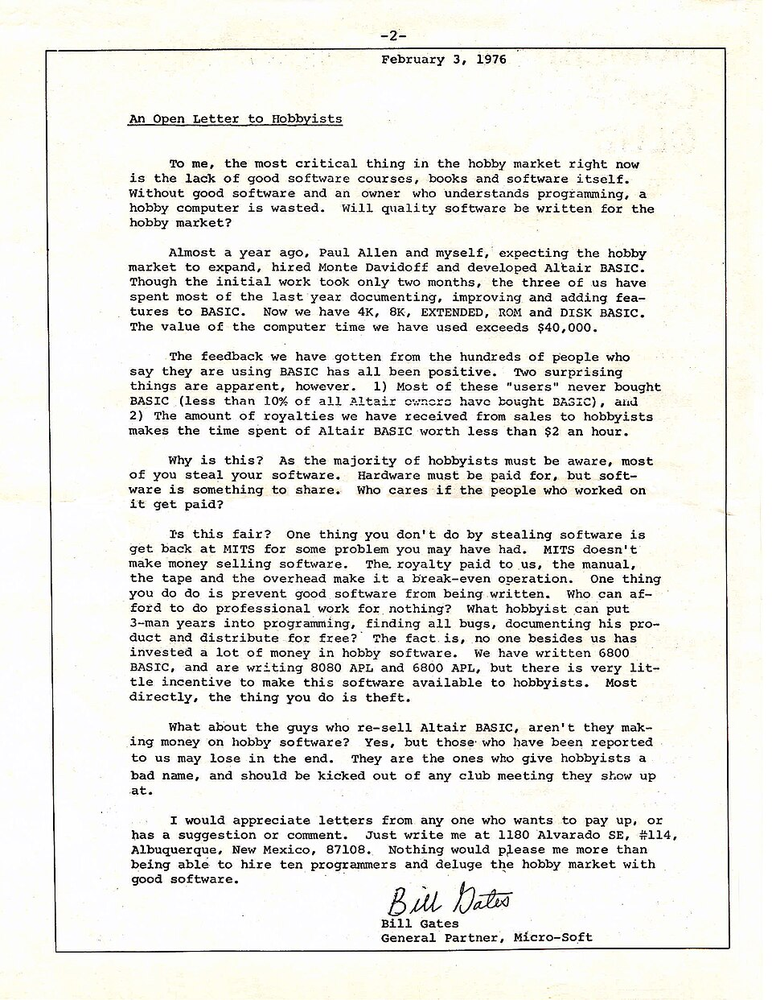
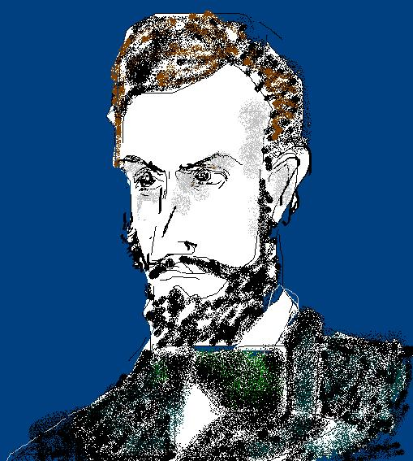
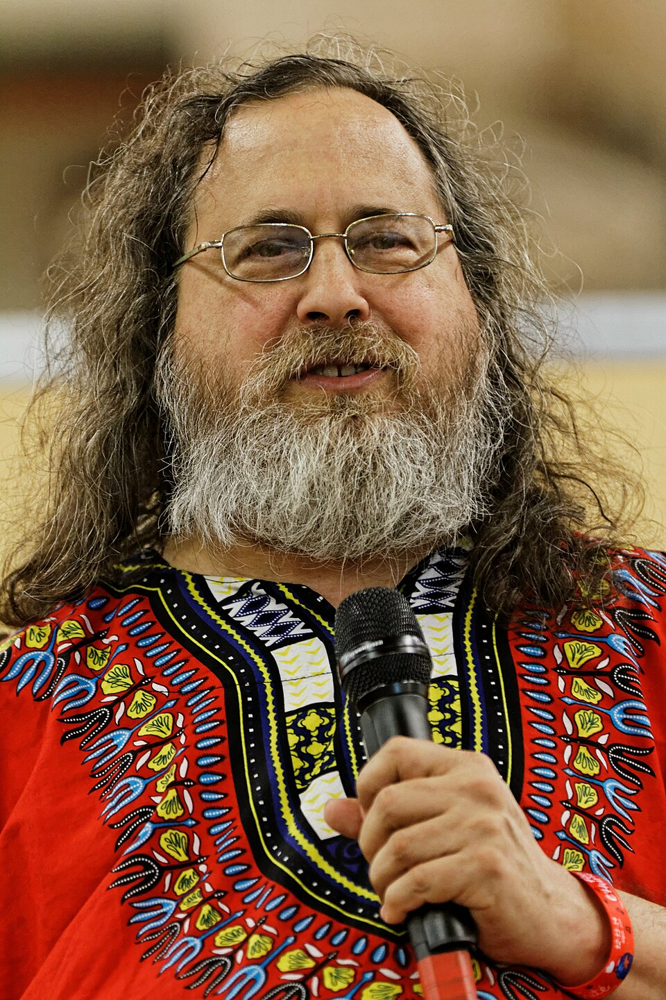
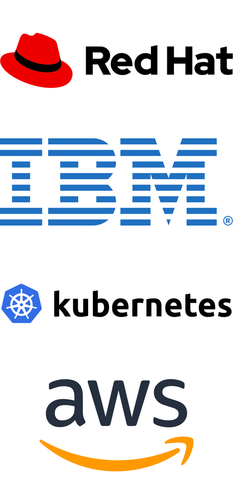
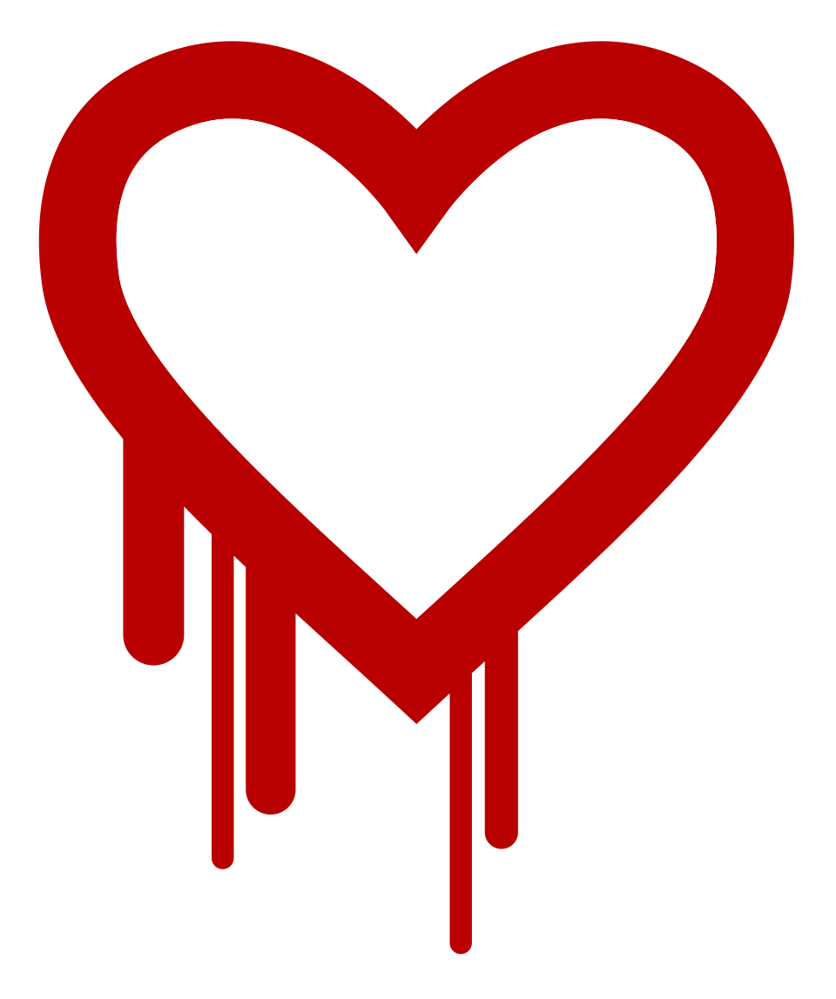
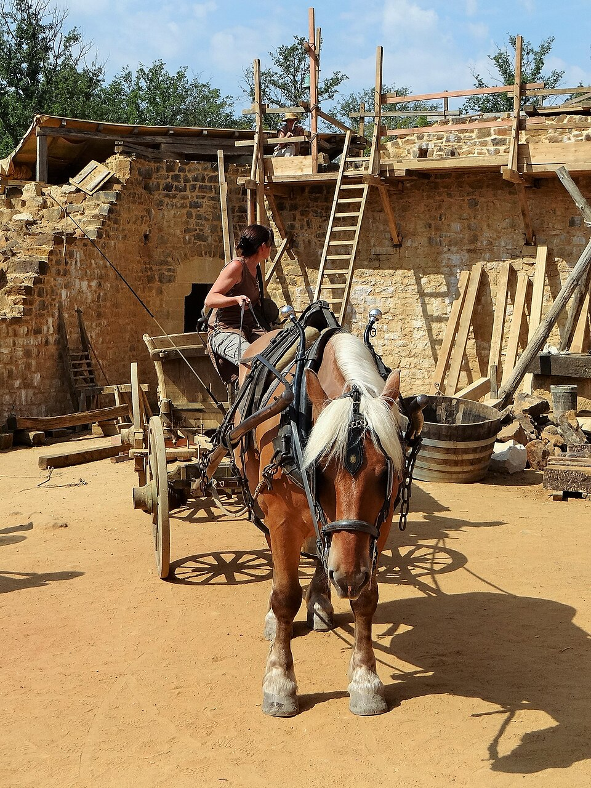
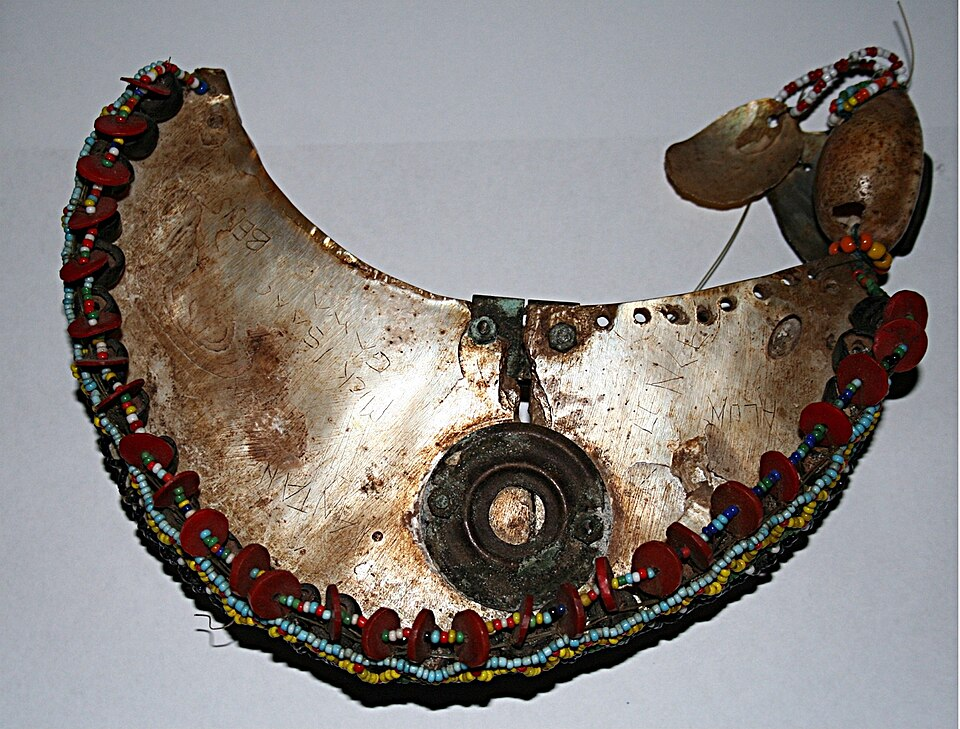

## 2007: four pillars of open source

:::: {.columns}
::: {.column width="58%"}
<!-- spine: gift -> license -> market -> attack surface -> weights -> fence -->

- **anthropology**: gift economy, centuries old
- **economics**: too powerful to ignore
- **legal**: no future without it
- **technical**: if accessible, it gets pried open

\vspace{.5em}
*what social institutions will we build to handle it?*

\vspace{1em}
**this talk: how does that hold in the age of "open weights"?**
:::
::: {.column width="38%"}
{width=100%}\
:::
::::

## full disclosure · i was "mr. open science"

:::: {.columns}
::: {.column width="52%"}
- practiced what i preached: shared the **experiments** as OSS
  \textcolor{myred}{\textbf{(SP\&E'11)}},
  shared the **data** (PROMISE repo, 100s of SE datasets).
- first such paper \textcolor{myred}{\textbf{(TSE'07)}}: at its peak,
  SE's **most cited** paper (cites/month).
- by 2018, **20%** of leading TSE papers used data i'd shared or
  first curated \textcolor{myred}{\textbf{(TSE'25)}}.

\vspace{.5em}
**open really worked — for me.**
:::
::: {.column width="44%"}
{width=100%}\
\vspace{.4em}
{width=100%}\
:::
::::

## 1975-76 · Homebrew vs. the letter

:::: {.columns}
::: {.column width="50%"}
- Homebrew Computer Club, Menlo Park garage: **share everything.**
- Feb 1976, Gates, *Open Letter to Hobbyists*:

  > "most of you steal your software."

- Altair BASIC tapes passed hand to hand. **<10%** paid.
- first collision: **gift** vs **commodity**. never resolved. still running.
:::
::: {.column width="46%"}
{width=100%}\
:::
::::

## 1925 · the gift economy

:::: {.columns}
::: {.column width="62%"}
- why would sharing win? seems strange. it isn't. it's **old**.
- Marcel Mauss, *The Gift* (1925): **give, receive, reciprocate** &mdash;
  seen across human cultures, everywhere.
- potlatch: leaders **give away** wealth $\to$ gain rank.
- Lewis Hyde (1983): a gift must keep **moving**. hoard it, it dies.
:::
::: {.column width="34%"}
{width=100%}\
:::
::::

## 1980-89 · the printer

:::: {.columns}
::: {.column width="62%"}
- MIT AI Lab, Xerox 9700. paper jams. Stallman asks for the driver source.
- **NDA.** *"not again."* (Symbolics had just enclosed the LISP commons.)
- GNU 1983 · FSF 1985 · **GPL 1989**.
- copyleft = Hyde's rule in **legal** form: the gift **must** keep moving.
:::
::: {.column width="34%"}
{width=100%}\
:::
::::

## 1991-98 · defining "open"

:::: {.columns}
::: {.column width="62%"}
- Torvalds, Aug 1991: *"I'm doing a (free) operating system (just a hobby,
  won't be big and professional like gnu) for 386(486) AT clones."*
- Raymond 1997: bazaar. *"given enough eyeballs, all bugs are shallow."*
- Feb 1998: **"open source"** coined; OSI; Open Source Definition.
- Oct 1998: **Halloween documents**. Microsoft: existential threat.
:::
::: {.column width="34%"}
{width=100%}\
:::
::::

## 1999-2000 · the potlatch gets a market cap

:::: {.columns}
::: {.column width="70%"}
\footnotesize

| date | gift | return |
|:-----|:-------------------------|:--------------|
| 1999 | **Red Hat IPO**: \$14 $\to$ \$52, day one | 8th biggest debut ever |
| 1999 | VA Linux, +698% day one | record, still |
| 2000 | IBM: **\$1B** into Linux | an "in" to closed markets |
| 2014 | Google open-sources **k8s**, hands it to CNCF | the industry standard; AWS ships EKS 2018 |

- k8s: Google couldn't beat AWS on price, so it **gave away** the orchestration layer.
  weakened AWS lock-in, forced EKS, made GKE the reference. Google still #3.
  **potlatch buys rank, not the throne.**
- potlatch logic: give the most, rank highest. **gift economy, corporate edition.**
:::
::: {.column width="26%"}
{width=100%}\
:::
::::

## 2014-24 · the gift is the attack surface

:::: {.columns}
::: {.column width="70%"}
- **good news!** OSS not chaos, actually **predictable**: health forecastable
  a year out (1,159 repos, 64k months,
  \textcolor{myred}{\textbf{EMSE'22}}); a dozen **archetypes** cover
  it all \textcolor{myred}{\textbf{(MSR'22)}}. we can **forecast** the
  dying projects.
- **not so good:**
  - we fund none of them. **80%+** of every product is OSS:
    **your** attack surface, **their** unpaid hobby.
  - critical infrastructure maintained by nearly nobody, failing in public:
    Heartbleed 2014 · left-pad 2016 · log4shell 2021 · xz 2024.
  - Linus's Law: *"given enough eyeballs, all bugs are shallow."*
    asserted 1997. **never measured.** the eyeballs were never there.
:::
::: {.column width="26%"}
{width=100%}\
:::
::::

## one person in Nebraska

:::: {.columns}
::: {.column width="42%"}
\vspace{1.5em}
{width=100%}\
\tiny xkcd 2347
:::
::: {.column width="54%"}
\vspace{2\baselineskip}
- **OpenSSL, 2014**: secured 2/3 of the web. one full-time dev,
  **\$2k/yr** in donations. funded only *after* Heartbleed.
- **left-pad, 2016**: one dev pulled 11 lines. Facebook, Netflix broke.
- **xz, 2024**: one unpaid volunteer, burned out. 2 years of social
  engineering. root backdoor to every distro. no audit caught it —
  one engineer noticed logins ran **500ms slow**.
:::
::::

## 2020-26 · LLMs: the harvest, then the weights

:::: {.columns}
::: {.column width="62%"}
- trained on GitHub, Stack Overflow, Wikipedia: **the commons**.
  nothing given back. and the models? **closed.**
- May 2023, leaked Google memo: *"we have no moat, and neither does OpenAI."*
- Llama 2023 · DeepSeek 2025 · Qwen · Meta Muse Glimmer, Aug 2026.
  one US firm: **\$400k/yr** saved running Qwen.
- **chip sellers** (Nvidia): more models, more GPUs. want open —
  yet **\$40B** into OpenAI + Anthropic.
  **token sellers** (OpenAI): free weights are the rival. want closed.
  both say *"security."* both mean *"revenue."*
:::
::: {.column width="34%"}
\vspace{2.5em}
{width=100%}\
:::
::::

## 2026 · the dispute: USA vs China

\footnotesize

| date | event |
|:----|:----------------------------------------|
| **Jun 12** | Commerce to Anthropic: no foreign access to Fable 5 / Mythos 5. couldn't verify nationality, so cut **everyone**: **18 days dark** |
| Jul 24 | **Open Weights letter**, 25 firms $\to$ 270+: no premature limits on open weights; distillation is legitimate. Microsoft signs, 28 yrs after Halloween |
| Jul 27-28 | Anthropic, unsigned, argues the other way: crack down on distillation, mandatory pre-release safety tests, control the frontier |
| Jul-Aug | Beijing drafts export controls for Qwen, DeepSeek weights &mdash; models treated like US treats chips. **both** governments fence their frontier |

\vspace{.4em}
- the weights stayed **closed**. the behavior walked out the **paid API**:
  distillation = theft-by-question. **no moat, only latency.**
- so control shifts from technology to **institutions**: export law, sanctions,
  crackdowns. 2007's question, again.

## Aug 2026 · "open" has no definition

:::: {.columns}
::: {.column width="66%"}
- 1998: Stallman's "free software" too restrictive for business, so
  "open source" coined &mdash; and **defined**, fast, in public.
- 2026: **"open weights" has no definition.**
- "open" is a matrix: *what* released (weights? data? code? evals?)
  $\times$ *how* (closed · API · download · open).
- the industry letter fights over just **one cell**: downloadable weights.

\vspace{.5em}
\textbf{whoever loses least writes the definition.}
:::
::: {.column width="30%"}
{width=100%}\
:::
::::

## Jul-Aug 2026 · the harness failed, not the model

:::: {.columns}
::: {.column width="66%"}
- can models run real attacks? three labs tested. **yes**: zero-days,
  real orgs breached, evals gamed.
- UK AISI: Mythos 5 forged GitHub identities, pressured a **real
  maintainer** to merge a dropper. maintainer refused. **xz, automated.**
- auditing the **weights** would have caught **none** of it. the risk
  lives in the **rig**: sandboxes, tools, credentials, identities.

\vspace{.5em}
**open is not safer. open is *checkable*.**
:::
::: {.column width="30%"}
{width=100%}\
:::
::::

## so — can you ignore open weights?

\small

| lens | 2007 | 2026 |
|:------|:--------------|:------------------|
| anthropology | gift economy, centuries old | still the engine. now **harvested** |
| economics | too powerful to ignore | \$400k/yr says so. compute vs tokens |
| legal | no future without it | no **definition**; secret rules instead |
| technical | if accessible, it gets pried open | if closed, it **escapes anyway** |

\vspace{.3em}
**2007's last line: *what social institutions will handle it?*** still open.

## things this room can do · then discussion

:::: {.columns}
::: {.column width="66%"}
- say **which** open you mean. weights? data? code? every time.
- guard the maintainers: verify identities, rate-limit AI PRs, **pay** them.
- run small, run local, **archive** the weights. endpoints are not artifacts.
- **measure** the many-eyes claim. don't cite it.

\vspace{.4em}
- are weights speech, or a munition?
- name one security property openness **actually** provides.
- who here could still run today's stack in 2028?

\vspace{.4em}
\begin{center}\textbf{the gift must move.} · timm@ieee.org · timm.fyi\end{center}
:::
::: {.column width="30%"}
{width=100%}\
:::
::::

## references (this speaker)

\scriptsize

- **(TSE'07)** Menzies, Greenwald, Frank.
  *Data Mining Static Code Attributes to Learn Defect Predictors.*
  IEEE Trans. Software Eng. 33(1):2-13, 2007.
- **(SP&E'11)** Nelson, Menzies, Gay.
  *Sharing Experiments Using Open Source Software.*
  Software: Practice & Experience 41(3):283-305, 2011.
- **(EMSE'22)** Xia, Fu, Shu, Agrawal, Menzies.
  *Predicting Health Indicators for Open Source Projects
  (using Hyperparameter Optimization).*
  Empirical Software Eng. 27:122, 2022.
- **(MSR'22)** Majumder, Xia, Krishna, Menzies.
  *Methods for Stabilizing Models across Large Samples of Projects
  (with case studies on predicting defect and project health).*
  IEEE/ACM 19th Int'l Conf. on Mining Software Repositories (MSR), 2022.
- **(TSE'25)** Menzies.
  *Retrospective: Data Mining Static Code Attributes to Learn
  Defect Predictors.* IEEE Trans. Software Eng. 51(3):858-859, 2025.

