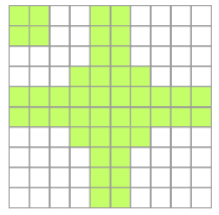
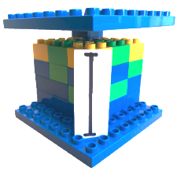
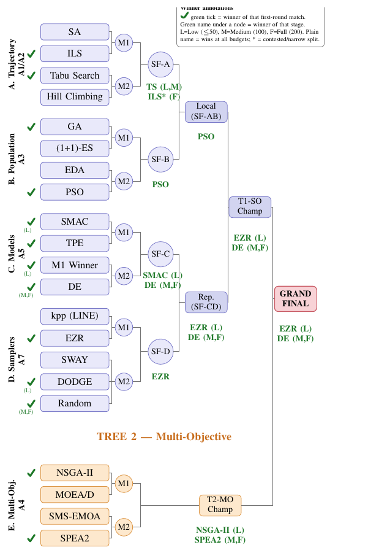

<!-- _class: lead invert -->
<!-- _paginate: false -->

# <!-- fit --> DEBLOAT

### a short history of theory — and where scale runs out

**Tim Menzies**    
Computer Science, NC State, USA   
<timm@ieee.org>   
<http://timm.fyi>    
July 2026 

<!-- spine: confidence -> doubt -> computation -> frugal -->

---

## credits

- **Kishan Ganguly** &middot; *BINGO* (FSE) + *budget-aware reasoning* (arXiv).
- **Amirali Rayegan** &middot; *simpler explanation* (JSS) + *explanation stability* (arXiv).
- **Srinath Srinivasan** &middot; *EZR.py* (arXiv) + *neurosymbolic systems* (arXiv).

---

<!-- _class: tight -->

## ezr: a case study in debloat

| six myths | reality |
|---|---|
| heavy infra | **stdlib** |
| each task its own algo | **same 4 classes** |
| trees differ by type | **1-line flip** |
| newer beats older | **SA'83 wins** |
| need massive data | **100 labels = 85-95%** |
| text needs big models | **30-line NB > SVM** |

| by the numbers | |
|---|---|
| vs. SMAC3 | **500x faster** |
| labels to optimum | **< 100** |
| features used | **< 10** |
| code size | **400 lines** |
| install size | **< 1 MB** |
| tasks tested | **120+** |

<https://github.com/timm/ezr> &middot; the *what* — before the *how*, first the **why**.

---

<!-- _class: lead bleed -->

> Before you buy a Ferrari
> to drive to the grocery store,
> **try walking.**

---

<!-- _class: lead bleed big -->

## the bet

> the world is **legible**
> because it is **readable**.

read it, and you can **reason** about it.

---

## Galileo — nature is legible

> the book of nature is written in mathematics.

- it can be **read**, not just feared.

---

## Newton — read here, know there

- one law unifies **heaven + earth**.
- **read the earth** -> reason about the sky.
- same physics on Jupiter (Kelvin-Helmholtz bands).

---

## Maxwell — fewer things to read

- electricity + magnetism + light -> **one** field.
- the forces turn out to be **synonyms**.
- predicted **c** from two bench constants.
- less to read than we feared.

---

## Noether — read one, infer another

- 1918: every **symmetry** -> a **conservation law**.
- read one quantity, **infer** its partner.
- explains *why* the world is readable at all.
- the deepest answer Galileo's bet ever got.

---

## the stream — read it statistically

- Maxwell + Boltzmann (1860s-70s): statistical mechanics.
- stop reading every particle. read the **ensemble**.
- the world becomes a **stream** — predict where it flows.
- temperature = ignorance, managed well.

---

## reading the past -> the future

- Pascal-Fermat (1654): forward — known setup -> odds.
- Bayes / Laplace: inverse — evidence -> hidden cause.
- inverse probability = **learning**. ancestor of ML.
- Laplace: probability = measured **ignorance**.

---

## reading the world: not always easy

- Poincare: 3 bodies break determinism.
- quantum: **irreducible** chance.
- Godel: truths no proof reaches.
- Turing: undecidability.

---

## algorithm before machine

- Lovelace (1843): first algorithm — a program **made to be read**.
- Hopper (1952): the compiler — now **machines** read our symbols.
- code = one text **both human and machine** can read.

---

## the computational turn

- Shannon: the **bit** — reading made measurable.
- von Neumann: Monte Carlo — read the world by sampling.
- Lorenz (1963): round a number, weather flips.
  tiny **misread** -> wild divergence. some streams **can't** be read far ahead.

---

## where we are now

- Kolmogorov: shortest program = most **readable** description.
- Pearl: read **causes**, not just correlations.
- Gigerenzer: read **less** — fast & frugal cues.

---

## Simon — bounded rationality

- Simon (1956): **satisficing** — read enough, then act.
- Carnegie school. Nobel 1978.
- the perfect optimizer never **halts**: always one more thing to read.
- it loses not to a smarter rival but to **time** — clock out before it stops.

---

## SBSE — search lands in SE

- Harman & Jones (2001): SE problems = **search** problems.
- precursor: Clark et al, York (2000) — metaheuristics in SE.
- when code's too big to **read**, **search** it instead.
- the SE-domain bet on **scale + search**.

---

<!-- _class: lead -->

## the modern claim

> general methods that **leverage computation** always win.
> cleverness loses to scale + search.

— Sutton, *The Bitter Lesson* (2019)

- condones **exponential** resource growth -> now hitting **hard limits**.
- assumes you can **evaluate at runtime**.
- so slow props — **maintainability, security** — go **unscored**.

### ... does it?

---

## the hidden precondition

- search and learning both **spend** evaluations.
- the lesson assumes a **free oracle**: cheap, instant, ~infinite.
- chess/Go: rules give exact win/loss, unlimited self-play.
- speech/vision: labeled corpora, a loss in microseconds.

---

## slow properties have no free oracle

- **maintainability**: signal months later, noisy, can't self-play.
- **reliability**: tail events — needs long runtime or proof.
- **security**: failure is adversarial, shows up after ship.
- each eval is *slow, costly, human.*

---

<!-- _class: lead -->

## the real axis

not scale vs cleverness.

# <!-- fit --> eval cost × latency × availability

- cheap/instant evals -> Sutton wins.
- expensive/slow/human -> frugal is the **only** thing that runs.

---

## biting the future

- the lesson is a **margin loan** on Moore's law.
- assumes resources keep growing exponentially.
- Dennard dead (~2006). cost/transistor flat past 28nm.
- peak data. megawatt training. returns are power-law.
- exponential -> **logistic**. the collateral is capping.

---

## Wirth's witness

- reflex: *"write it loose, faster CPUs bail you out."*
- **Wirth's law**: bloat outruns hardware. you fall behind.
- the bet lost **during** the boom — exponential fully running.
- Wirth is the **prosecution**, not the defense.

---

<!-- _class: lead -->

## Jevons closes the door

> cheaper coal -> **more** coal burned.

— Jevons (1865)

- cheaper compute -> bigger models -> nothing banked.
- frugality is **chosen**, never delivered.

---

<!-- _class: lead glow -->

## the thesis

- scale beats cleverness **only** where evaluation is free.
- most of software has **no free oracle**.
- bounded resource, bounded mind, frugal toolbox.

# <!-- fit --> *simple ain't stupid.*

---

<!-- _class: lead bleed -->

## close

- Gigerenzer's second revolution, replayed in SE.
- the omniscient demon was always a **dream**.
- build for the world we're in: **bounded, capping, costly to check.**

---

<!-- _class: lead bleed -->

# case study

## can AI be easy?

---

## reading the world is costly — so we strip it

> *"explain the phenomena by the simplest hypothesis possible."*
> — Ptolemy, 130 AD &middot; Occam, ~1300

- **1902** PCA &middot; **1974** prototypes &middot; **1997** feature selection
- **2009** active learning &middot; **2010s** surrogates &middot; **2020s** distillation
- 120 years, one move: **throw most of it away.**

---

## we forget to subtract

- make the logo symmetric / the tower stronger?
- people **add** tiles & struts — rarely **remove** the bad ones.
- Adams (*Nature* 2021) / Fillon: additive : subtractive = **4 : 1**.
- *"humans needlessly complicate their designs."*
- **DEBLOAT** = the move we're blind to.

---

## EZR.py

- **400 lines** of Python. stdlib only. <1MB install.
- 120+ tabular SE tasks: matches/beats SMAC3, SHAP, LIME, FASTREAD.
- **500x faster.** under **100 labels.**

w/ **Srinath Srinivasan**.

---

## EZR wins the tournament

- 20 optimizers &middot; 106 MOOT tasks &middot; 4 budgets &middot; **14,000 CPU-hrs**.
- a bracket of SBSE assumptions — EZR takes the **grand final** at few labels.
- NSGA-II needs **1000** samples for what EZR reaches in **50**.
- a cheap rule even predicts the winner: ties/beats the oracle on **75%**.

---

## same wins, far less data

- *Minimal Data, Maximum Clarity* (Rayegan).
- **>90%** of best-known optimization across **60** datasets.
- on a **fraction** of the labels full supervision needs.
- its decision-tree reasons **beat** LIME / SHAP / BreakDown.

---

## and it makes LLMs better

- **SNAP2**: cheap classical learner **seeds**, the LLM **finishes**.
- best of all methods on **85%** of 100+ SE tasks (LLM-alone: 75%).
- **30% fewer tokens**, **1.4x faster** — EZR does the cheap work first.
- classical-then-LLM **beats either alone**.

---

## why so few labels work

- **BINGO** (Ganguly): 10k rows collapse to ~**100** filled buckets.
- **PromiseTune** (Chen): the wins sit in a **tiny** promising region.
- Chen: useful part of **y** is small. me: useful part of **x** is small.
- both axes mostly empty -> a handful of labels **is** the data.

---

## how — strip the redundancy

- read the code. many *"different"* algorithms collapse.
- 4 classes: `Num`, `Sym`, `Cols`, `Data`.
- 1-line flip: decision tree numeric <-> symbolic.
- 1983 Simulated Annealing still beats modern Local Search.
- Spärck Jones (1972) IDF -> 30-line NB beats SVM on text.

---

<!-- _class: lead invert -->

# <!-- fit --> how many complex SE problems...

# <!-- fit --> aren't?

---

<!-- _class: lead -->

## the punchline

- scope: tabular SE. generative (LLMs, images) TBD.
- 30-line NB beating SVM on text hints it extends.
- developers still need to **read code**.

### arXiv:2606.03640
